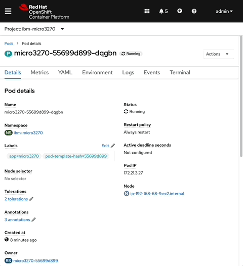

# micro3270
A containerized lightweight multi-architecture compatible [3270 emulator](https://en.wikipedia.org/wiki/IBM_3270).  

### Features
- Multi-architecture compatibility for `amd64`, `arm64`, and `s390x`
- OpenShift Container Platform (OCP) and [Kubernetes compatible](kube/README.md)
- Mountable configurations and session files with [TLS Support](#running-locally-with-tls)
- Minimized image size: `~40MB`



## Usage Guide
Run this image using [`podman`](https://podman-desktop.io/) with a specified z/OS hostname/ip and port.

**Environment Variables**
- `ZOS_HOST` - The hostname or IP address of a reachable z/OS host
- `ZOS_PORT` - optional, for specifying a non-default telnet port

**Directories & Files**
- `/micro3270` - default directory within container, contains basic installation files
- `/micro3270/config` - (optional) configuration directory, expected to be volume mounted from container runtime 
- `/micro3270/config/.c3270` - (optional) configuration file for setting [configuration options](https://x3270.miraheze.org/wiki/C3270/Command-line_options), will be overwritten by volume mount
- `/micro3270/config/cacert` - (optional) directory containing [TLS certificates](#running-locally-with-tls)


## Running Locally
Launch a terminal application and run one of the following commands. 

```bash
podman run -it icr.io/zmodstack/micro3270 $ZOS_HOST $ZOS_PORT
```

With additional [command-line options](https://x3270.miraheze.org/wiki/C3270/Command-line_options)
```bash
podman run -it icr.io/zmodstack/micro3270 [options] $ZOS_HOST $ZOS_PORT
```

## Running with TLS Certicates
For z/OS environments that require TLS connectivity with self-signed certificates, certificates can be placed in the `/micro3270/config` directory. This can be done via [volume mounting](https://docs.podman.io/en/latest/markdown/podman-run.1.html#mounting-external-volumes) with your container runtime, or through copying files directly into the container's ephemeral filesystem.

Using a "rootless" `podman` environment where the `podman-machine` does NOT have access to the local machine's filesystem

```bash
# Create new empty volume
podman volume create micro3270-config

# Create a temporary micro3270 container with the volume mounted
podman create --name micro3270 -v micro3270-config:/micro3270/config icr.io/zmodstack/micro3270

# Copy files to container with mounted volume
podman cp </path/to/local/cert> micro3270:/micro3270/config/cacert

# Remove temporary container
podman rm micro3270

# Run the micro3270 container
podman run -it --rm --name micro3270 -v micro3270-config:/micro3270/config icr.io/zmodstack/micro3270 [options] $ZOS_HOST $ZOS_PORT
```

### Skipping TLS Verification
TLS certificate verification may be skipped using the `c3270` `-noverifycert` [command-line option](https://x3270.miraheze.org/wiki/C3270/Command-line_options). 

:warning: This is NOT recommended and may leave you vulnerable to MITM attacks.

```bash
podman run -it --rm --name micro3270 icr.io/zmodstack/micro3270 -noverifycert $ZOS_HOST $ZOS_PORT
```


## Running with Session Profiles
A custom `.c3270` session file may be copied into the `/micro3270/config/` directory.

To create a local `.c3270` session profile, reference the `c3270` [command-line options](https://x3270.miraheze.org/wiki/C3270/Command-line_options) and use the "resource format" seen in the **Resource and Further Details** column. 

Create a `.c3270` file for a specific z/OS host, e.g. `somezoshost.c3270`
```bash
c3270.caFile: /micro3270/config/cacert
c3270.hostname: some.zos.host.com
c3270.port: 23

! Set additional resource values as necessary
! c3270.acceptHostname: <private-ip>
```
Copy the `somezoshost.c3270` file into your container into the `/micro3270/config/.c3270` location.
```bash
podman cp </path/to/local/somezoshost.c3270> micro3270:/micro3270/config/.c3270
podman run -it --rm --name micro3270 -v micro3270-config:/micro3270/config icr.io/zmodstack/micro3270
```