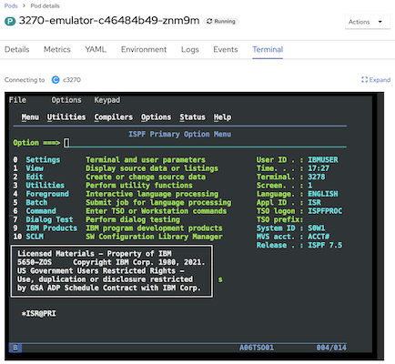

# micro3270
A containerized lightweight multi-architecture compatible [3270 emulator](https://en.wikipedia.org/wiki/IBM_3270).  

### Features
- Compiled from latest stable [`c3270`](https://x3270.miraheze.org/wiki/C3270) source
- Multi-architecture compatibility with `x86`, `arm64`, and `s390x`
- Minimized image size using RHEL8 [`ubi8-micro`](https://catalog.redhat.com/software/containers/ubi8/ubi-micro/5ff3f50a831939b08d1b832a) base and [multi-stage builds](https://docs.docker.com/build/building/multi-stage/)
- OpenShift Container Platform (OCP) and Kubernetes compatible



## Usage Guide
Run this image using `podman` with a specified z/OS hostname/ip and port.

**Environment Variables**
- `$ZOS_HOST` - The hostname or IP address of a reachable z/OS host
- `$ZOS_PORT` - optional, for specifying a non-default telnet port

**Directories & Files**
- `/micro3270/config.c3270` - (optional) configuration file location when providing a volume-mounted set of [configuration options](https://x3270.miraheze.org/wiki/C3270/Command-line_options)
- `/micro3270/certs/common_cacert` - optional directory containing TLS certificates, see [here](#running-locally-with-tls)


## Running Locally
Launch a terminal application and run one of the following commands. 

```bash
podman run -it icr.io/zmodstack/micro3270 $ZOS_HOST $ZOS_PORT
```

With additional [command-line options](https://x3270.miraheze.org/wiki/C3270/Command-line_options)
```bash
podman run -it icr.io/zmodstack/micro3270 [options] $ZOS_HOST $ZOS_PORT
```

### Running Locally with TLS
For z/OS environments that require TLS connectivity with self-signed certificates, certificates can be placed in the `/micro3270/certs` directory. This can be done via volume mounting with your container runtime, or through copying files directly into the container's ephemeral filesystem.

Using a "rootless" `podman` environment where the `podman-machine` does NOT have access to the local machine's filesystem
1. Create a new podman volume and copy certificate files to the volume (only needs to be done once, or whenever a new certificate is needed)
    1. Create the volume
        ```bash
        podman volume create micro3270-certs
        ```
    1. Launch a temporary container to copy files to the newly created volume (will timeout in 60s and be deleted)
        ```bash
        tmp_container=$(podman run -d --rm -v micro3270-certs:/micro3270/certs --entrypoint="timeout" icr.io/zmodstack/micro3270:0.4.0-rc.2 60s tail -f /dev/null)
        ```
    1. Copy local certificate(s) to volume
        ```bash
        podman cp </path/to/local/cert> tmp_container:/micro3270/certs/.
        ```
1. Run the container
    ```bash
    podman run -it -v micro3270-certs:/micro3270/certs icr.io/zmodstack/micro3270:0.4.0-rc.2 $ZOS_HOST $ZOS_PORT
    ```

## Building
To build locally using `podman`:
```bash
podman build . -t ibm/micro3270
```

### Using multi-architecture script
Install [Podman Desktop](https://podman-desktop.io/) and ensure your podman machine is configured for building multi-architecture images.

```bash
./scripts/build-oci.sh
```

### Building c3270 from source
This image pulls the latest stable tag, currently `4.2ga10`, from the official `x3270` [GitHub Repository](https://github.com/pmattes/x3270).

Latest stable versions are can be seen on the `x3270` wiki [Downloads page](https://x3270.miraheze.org/wiki/Downloads).